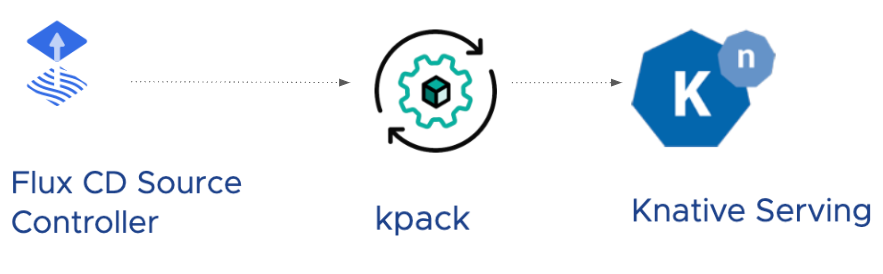

### Manual Application Deployment

##### The idea

Consider a simple Path to Production consisting of three steps:
1. Download application source code
2. Use the source code to produce a container image
3. Deploy the image and start the application

##### The plan

Now, you could write a script or a fancy little custom program to carry out each of these steps, but if you're going to run your Path to Production on Kubernetes, you don't have to!

The Kubernetes ecosystem is brimming with exciting projects, and you can find projects that precisely meet your needs.
For this workshop, you'll be working with:
1. FluxCD Source Controller - for downloading source code from git
2. kpack - for building and publishing container images
3. Knative Serving - for running applications

##### Halfway there!
By simply using these tools, you're well on your way to establishing a working Path to Production. Woohoo!

##### However...
There is still a gap to be filled in integrating these tools into a logical workflow and in providing a positive developer experience.
In the next few exercises, you will learn how you can close this gap using Cartographer.

##### But first...
To better understand the workflow and identify the opportunities for automation, start by walking through the process manually.
