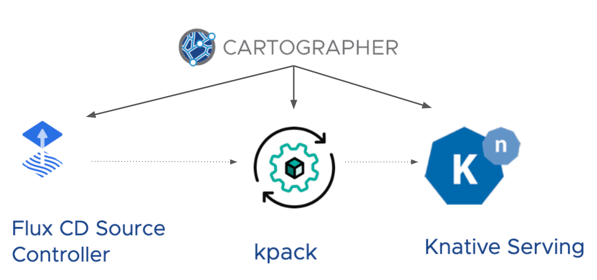

Cartographer is an open source tool for choreographing software supply chains.

In this exercise, you will use Cartographer to automate the simple workflow you just executed manually.



## Templates

Cartographer provides an API layer to manage the set of resources in a workflow. This API layer consists of several templates.

List the available types of templates.
```execute-1
kubectl api-resources | grep carto | grep template
```

## ClusterSourceTemplate

For the FluxCD Source Controller activity—the first resource in the workflow—you will need a ClusterSourceTemplate. This template takes arbitrary YAML as input and outputs two values: _url_ and _revision_.

Create a new file with the basic configuration for a ClusterSourceTemplate.
```editor:insert-lines-before-line
file: source.yaml
line: 1
text: |-
    apiVersion: carto.run/v1alpha1
    kind: ClusterSourceTemplate
    metadata:
      name: source
    spec:
      urlPath: 
      revisionPath: 
      template:
```

The _template_ field can contain any arbitrary YAML configuration that you want Cartographer to submit to the Kubernetes API Server.
Since you want Cartographer to create the GitRepository resource for you, copy the configuration that you applied manually in the previous step into this file.
```editor:select-matching-text
file: source.yaml
text: "template"
start: 0
stop: 1
```

```editor:replace-text-selection
file: source.yaml
text: |-
    template:
      apiVersion: source.toolkit.fluxcd.io/v1beta1
      kind: GitRepository
      metadata:
        name: hello-world
      spec:
        interval: 1m0s
        url: https://github.com/ciberkleid/hello-go
        ref:
          branch: main
        gitImplementation: libgit2
        ignore: ""
```

By providing the GitRepository configuration to the ClusterSourceTemplate, you've given Cartographer the ability to create the resource and monitor its status.
When Cartographer detects a change in the status, it can extract values. But... which values should it extract?

Recall the value the you copied from the GitRepository resource status.
It was found under `.status.artifact.url`.

In order for Cartographer to extract the same value automatically, you need to provide the **path** to the value.

```editor:insert-value-into-yaml
file: source.yaml
path: spec.urlPath
value: .status.artifact.url
```

Although it is not used in this example, you can also set a value for the other output field of a ClusterSourceTemplate, revision.
```editor:insert-value-into-yaml
file: source.yaml
path: spec.revisionPath
value: .status.artifact.revision
```

Now, Cartographer can create the resource, monitor its status, and extract the desired value(s).

You'll need to wrap the kpack Image and Knative Serving service resources in Cartographer templates as well, but before you do that, let's explore how a template can be used for many different applications.

## Workload

Currently, the ClusterSourceTemplate you have will stamp out a single resource with a hard-coded git url.
```editor:select-matching-text
file: source.yaml
text: "url"
before: 0
after: 2
```

However, you will want to use this template for many different applications, and each application will have a unique url and branch.
It makes sense to encapsulate all application-specific values into a separate object.

To this end, Cartographer provides a Workload API.
The Workload makes it possible to expose only the necessary hooks for developers to onboard their applications onto the Path to Production, without exposing them to the nuts and bolts of the supply chain configuration.
This provides a clear separation of concerns between developers and operators and improves the developer experience.

Create a Workload with application-specific details.
```editor:insert-lines-before-line
file: workload.yaml
line: 1
text: |-
    apiVersion: carto.run/v1alpha1
    kind: Workload
    metadata:
      name: hello-world
      labels:
        app.tanzu.vmware.com/workload-type: web
    spec:
      serviceAccountName: default
      source:
        git:
          url: https://github.com/ciberkleid/hello-go
          ref:
            branch: main
```

Note specifically the application-specific source configuration.
```editor:select-matching-text
file: /home/eduk8s/intro/04_workload.yaml
text: "source"
before: 0
after: 4
```

## Parameterization

Now that you have a Workload context for developer-provided values, you can update the ClusterSourceTemplate to inject these values dynamically.

Find the hard-coded git url in the current ClusterSourceTemplate configuration.
```editor:select-matching-text
file: source.yaml
text: "https://github.com/ciberkleid/hello-go"
```

Replace this with a parameterizad value that maps to the Workload spec.
```editor:insert-value-into-yaml
file: source.yaml
path: spec.template.spec.url
value: $(workload.spec.source.git.url)$
```

Replace the branch.
```editor:insert-value-into-yaml
file: source.yaml
path: spec.template.spec.ref
value: $(workload.spec.source.git.ref)$
```

Finally, use the name of the Workload to ensure the GitRepository resource also has a unique name.
```editor:insert-value-into-yaml
file: source.yaml
path: spec.template.metadata.name
value: $(workload.metadata.name)$
```

Great! Your ClusterSourceTemplate can now be used to create GitRepository resources for any number of applications!

## ClusterImageTemplate

```execute-1
kubectl apply -f /home/eduk8s/intro/02_templated/source.yaml
```

Image Template

```editor:open-file
file: /home/eduk8s/intro/01_manual/image.yaml
```

```editor:open-file
file: /home/eduk8s/intro/02_templated/image.yaml
```

```editor:select-matching-text
file: /home/eduk8s/intro/02_templated/image.yaml
text: "template"
before: 0
after: 17
```

```editor:select-matching-text
file: /home/eduk8s/intro/02_templated/image.yaml
text: "imagePath"
before: 0
after: 0
```

```editor:select-matching-text
file: /home/eduk8s/intro/02_templated/image.yaml
text: "apiVersion"
before: 0
after: 1
```

```editor:select-matching-text
file: /home/eduk8s/intro/02_templated/image.yaml
text: "url: (.*)"
isRegex: true
```

```editor:replace-text-selection
file: /home/eduk8s/intro/02_templated/image.yaml
text: "url: $(sources.source.url)$"
```

```execute-1
kubectl apply -f /home/eduk8s/intro/02_templated/image.yaml
```

## ClusterTemplate

```editor:open-file
file: /home/eduk8s/intro/01_manual/app-deploy.yaml
```

```editor:open-file
file: /home/eduk8s/intro/02_templated/app-deploy.yaml
```

```editor:select-matching-text
file: /home/eduk8s/intro/02_templated/app-deploy.yaml
text: "template"
before: 0
after: 53
```

```editor:select-matching-text
file: /home/eduk8s/intro/02_templated/app-deploy.yaml
text: "imagePath"
before: 0
after: 0
```

```editor:select-matching-text
file: /home/eduk8s/intro/02_templated/app-deploy.yaml
text: "apiVersion"
before: 0
after: 1
```
