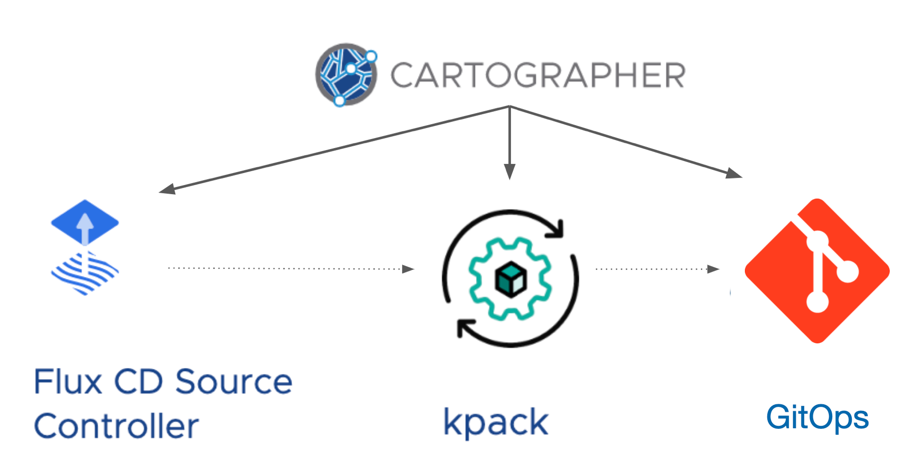
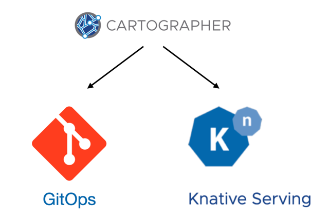

##### Improving the Supply Chain

That wasn't so bad! We've created our first supply chain for creating a running deliverable, but it's pretty simple. We get a secure container build, but it just creates a deployment into the same namespace where we've been working. This may be useful for local developer iteration, but not much else.

Let's think about a supply chain that can service multiple environments: QA, Staging, even Prod. We're going to modify our supply chain so that instead of outputting our Knative deployment, it will output a **description** of the deployment to a GitOps repo.



The deployment description captures all the data generated in the supply chain, such as the image reference of the secure container build. But now, it is in a format that can be stamped out onto any Kubernetes cluster, on any cloud, that has visibility to our Git repo.



##### Cleaning Up

Before we modify our supply chain to use this new approach, let's clear the resources running on our local environment. We can see the Kubernetes resources that have been stamped out by our existing supply chain.

```terminal:execute
command: kubectl get gitrepository,cnbimage,ksvc 
```

Fortunately, cleanup is a snap. Let's just delete the workload resource.

Delete workload
```terminal:execute
command: kubectl delete workload hello-world
```

Deleting the workload will delete all the resources that were managed by the supply chain.

```terminal:execute
command: kubectl get gitrepository,cnbimage,ksvc 
```

Now, we can get back to work.


