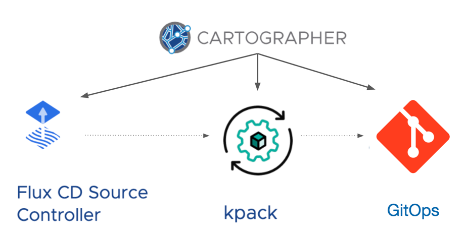

#### Running the Updated Supply Chain

Let's go ahead and apply the definition for our updated supply chain.

```terminal:execute
command: kubectl apply -f ~/exercises/supply-chain.yaml
```

Remember, this is the behavior we are implementing in our new definition:


Now, we will re-create our workload. This will cause our application to be delivered using the new supply chain:

Re-create workload
```terminal:execute
command: kubectl apply -f ~/exercises/workload.yaml
```

We can follow along as the supply chain progresses:
```terminal:execute-2
tanzu apps workload tail hello-world
```

Once the supply chain is complete, we can see there is no Knative Service running

```terminal:execute
command: kubectl get ksvc
```

Instead of creating a deployment, we have written a description of the deployment to our Git repo. Inspect the contents of the `manifest.yaml` file that was written out to Git.

```dashboard:open-url
url: https://gitea.{{ingress_domain}}/gitea_admin/osscon-deliveries/src/branch/{{session_namespace}}-hello-world/config
```

OK, now for the final step: using GitOps to run our application on target clusters.