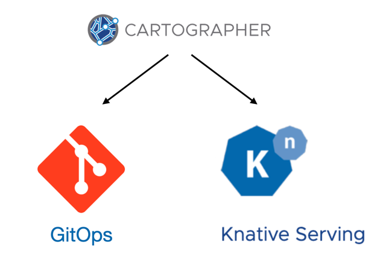

#### Cartographer Deliverables

It's worth noting that there is no magic in this final step. We are going to sync the contents of our GitOps repo with a target cluster. This probably sounds familiar. It's the same type of task that is accomplished by other popular open-source tools like [ArgoCD](https://argoproj.github.io/cd/) and [Flux](https://fluxcd.io/). If you have already adopted one of these tools, feel free to use them here! But we are going to show the Cartographer approach for achieving the same goal.

In Cartographer, delivery is completely decoupled from supply chains. This means we can define our delivery on a different cluster, or on any number of different clusters, from where the supply chain executed. Those clusters can live anywhere, even different clouds, as long as they have visibility to the GitOps repo. For purposes of this lab environment, however, we are going to define the delivery in the same namespace where we created the supply chain.

A `ClusterSupplyChain` resource was used to define our supply chain. A `ClusterDelivery` resource will be used to implement our delivery.

```editor:open-file
file: ~/exercises/examples/basic-delivery/app-operator/delivery.yaml
```

This is a pretty simple definition, as it only consists of two steps: Reading from the GitOps repo, and stamping out the (Knative Service) resource defined there into our target cluster.


The first template referenced is a `ClusterSourceTemplate`. Instead of reading developer source code, though, this Source Template will be reading the contents of the GitOps repo that were produced by the supply chain.

```editor:open-file
file: ~/exercises/examples/basic-delivery/app-operator/source-git-repository.yaml
```

The `ClusterDeploymentTemplate` will apply the resources from the GitOps repo to the cluster, and it will also output status information so that we can follow whether the deployment was successful.

```editor:open-file
file: ~/exercises/examples/basic-delivery/app-operator/deploy-app.yaml
```

Just as we needed to create a `Workload` resource to execute an instance of our supply chain, we will create a `Deliverable` resource to execute an instance of our delivery. 

Author Deliverable
```editor:insert-lines-before-line
file: /home/eduk8s/exercises/deliverable.yaml
line: 1
text: |-
    apiVersion: carto.run/v1alpha1
    kind: Deliverable
    metadata:
      name: hello-world-deployment
      labels:
        app.tanzu.vmware.com/deliverable-type:
    spec:
      serviceAccountName: default
      source:
        git:
          ref:
            branch:
          url:
```

Our deliverable needs to specify a `deliverable-type` (just as our workload specified a `workload-type`) to match our deliverable with the correct `ClusterDelivery`.

```editor:select-matching-text
file:  /home/eduk8s/exercises/deliverable.yaml
text: "app.tanzu.vmware.com/deliverable-type:"
```

The `deliverable-type` for our delivery is `osscon`

```editor:replace-text-selection
file:  /home/eduk8s/exercises/deliverable.yaml
text: "app.tanzu.vmware.com/deliverable-type: osscon"
```

The git info is parameterized, so we need to specify which GitOps repo we are consuming from.

```editor:select-matching-text
file:  /home/eduk8s/exercises/deliverable.yaml
text: "git:"
before: 0
after: 3
```

Enter the location of the Git resources that were written to by our supply chain:

```editor:replace-text-selection
file:  /home/eduk8s/exercises/deliverable.yaml
text: |2
      git:
        ref:
          branch: {{session_namespace}}-hello-world
        url: https://gitea.{{ingress_domain}}/gitea_admin/{{session_namespace}}
```

Now, we can apply our deliverable, which will begin execution of the `ClusterDelivery`

```terminal:execute
command: kubectl apply -f ~/exercises/deliverable.yaml
```

The deliverable stamps out a `GitRepository` resource for downloading from our GitOps repo:

```terminal:execute
command: kubectl get gitrepository hello-world-deployment
```

And now it deploys onto our cluster.

```terminal:execute
command: kn service list
```

Once the Knative service is reporting a status of Ready:True, we can hit the application endpoint:

```execute-1
curl http://hello-world-{{ session_namespace }}.{{ ingress_domain }}
```

We can check that everything completed well by checking the status of our deliverable:

```terminal:execute
command: kubectl get deliverable
```
